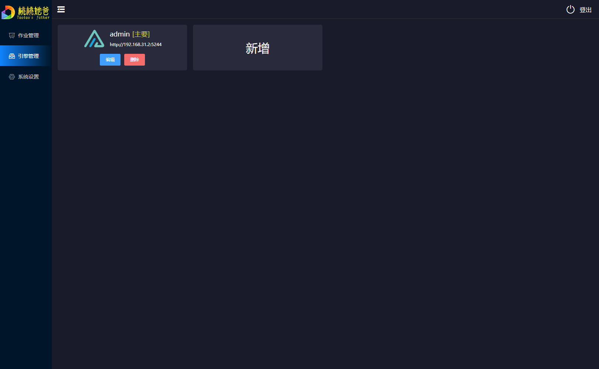
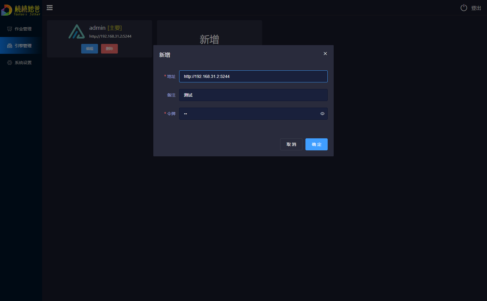
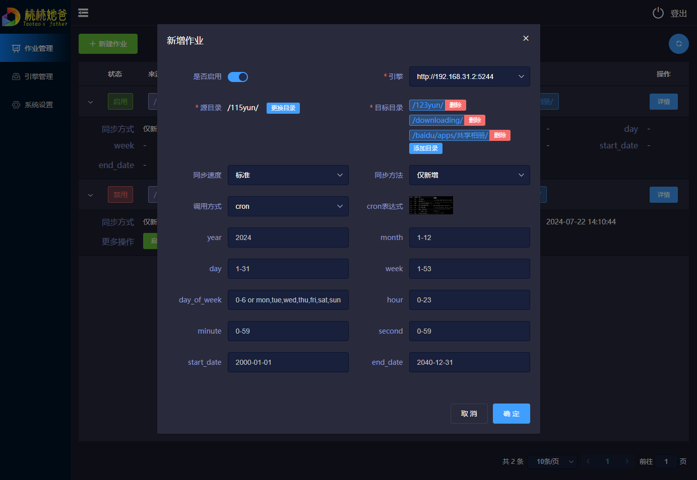
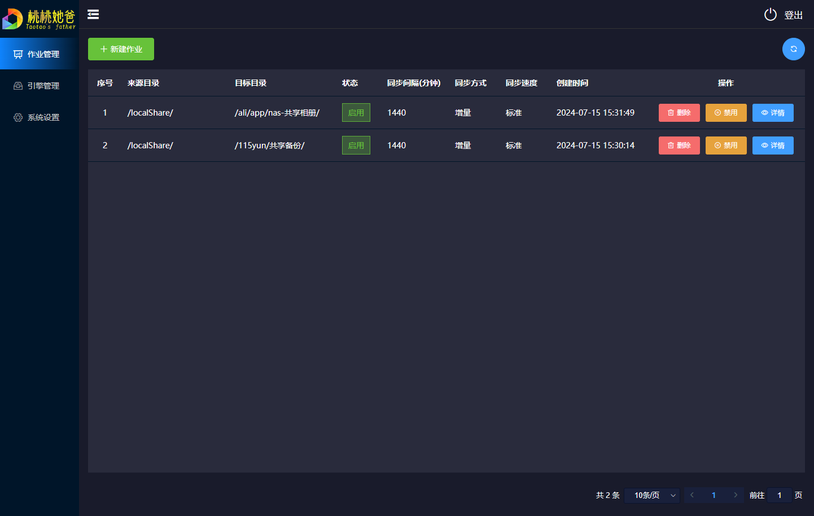
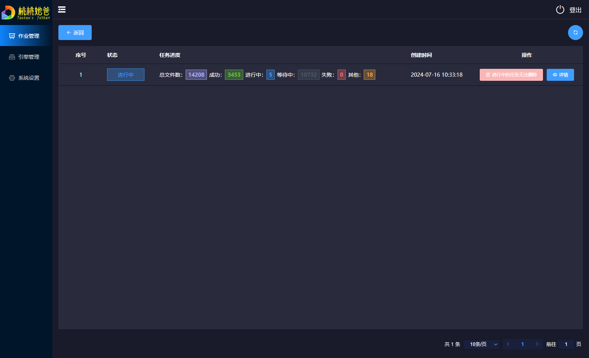
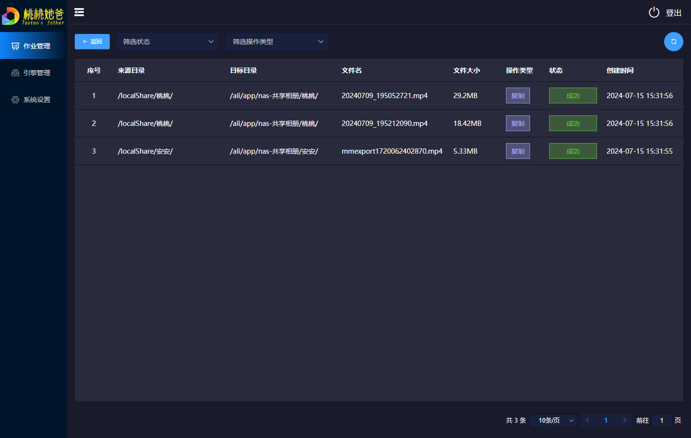

<div align="center">
  <a href=""></a>
  <p><em>TaoSync是一个适用于AList v3的自动化同步工具。</em></p>
  <div>
    <a href="https://github.com/dr34-m/taosync/blob/main/LICENSE">
      
    </a>
    <a href="https://github.com/dr34-m/taosync/actions?query=workflow%3A构建">
      
    </a>
    <a href="https://hub.docker.com/r/dr34m/tao-sync">
      
    </a>
  </div>
</div>

---

**如果好用，请Star！非常感谢！** 

[GitHub地址](https://github.com/dr34-m/taosync) [Gitee地址](https://gitee.com/dr34m/taosync)

本工具主要用于同步备份功能，可以定时扫描指定目录下文件差异，让目标目录与源目录相同（全同步模式）；或仅新增存在于源目录，却不存在于目标目录的文件（仅新增模式）。

桃桃是我女儿的名字，我女儿的名字叫桃桃。本工具意为：桃桃的自动同步工具

**警告！不要在外网暴露本系统，否则后果自负！**

> 本系统已经做了一定的安全方面的工作，但仍不能保证绝对安全。如确实需要，请务必使用强密码，并使用`SSL`

## 须知

`v0.2.0`不再兼容之前的版本（因为密码加密方式变更，如果用之前的库文件会提示密码错误，密码为单向加密，无法解密）

本工具不使用`AList`源码而是使用[AList v3 API](https://alist.nn.ci/zh/guide/api/apifox.html)来实现相关功能。使用本工具前你必须了解并且会使用[AList](https://github.com/alist-org/alist)

本工具没有集成`AList`，你需要额外启动`AList`

## 使用方法

```sh
docker run -d --restart=always -p 8023:8023 -v /opt/data:/app/data --name=taoSync dr34m/tao-sync:latest
```

把其中`/opt/data`替换为你实际的目录，然后访问`http://127.0.0.1:8023`

如果你没有修改，默认账号为`admin`，密码请到日志中查看输出，登录后请立即前往系统设置修改密码

> 如果没有显示这个日志，可以到挂载目录的`/log/sys_xxx.log`文件查看，通常在第一行

进入系统后先到`引擎管理`菜单创建引擎，然后前往`作业管理`创建同步作业

在绿联NAS中使用可以参考这里[如何在绿联NAS中使用TaoSync同步我的文件到各个网盘](https://blog.ctftools.com/2024/07/newpost-57/)

## 环境变量及其意义

修改环境变量需重启docker才能生效

| 变量名           | 描述                                                         | 默认值 |
| ---------------- | ------------------------------------------------------------ | ------ |
| TAO_EXPIRES      | 登录有效期，单位天                                           | 2      |
| TAO_LOG_LEVEL    | 日志等级：0-DEBUG，1-INFO，2-WARNING，3-ERROR，4-CRITICAL；数值越大，产生的日志越少，推荐1或2 | 1      |
| TAO_LOG_SAVE     | 系统日志保留天数，该天数之前的日志会自动清理，单位天，0表示不自动清理 | 7      |
| TAO_TASK_SAVE    | 任务记录保留天数，该天数之前的记录会自动清理，单位天，0表示不自动清理 | 0      |
| TAO_TASK_TIMEOUT | 任务执行超时时间，单位小时。一定要设置长一点，以免要备份的东西太多 | 72     |

## 页面截图

<details>

<summary>点击展开截图</summary>

由于更新频繁，截图仅供参考，以实际为准

#### 引擎管理



#### 引擎编辑



#### 新建作业 



#### 作业列表



#### 作业详情（任务列表）



#### 任务详情



</details>

# 更新记录

如想体验研发中的版本，可以尝试到[DockerHub](https://hub.docker.com/r/dr34m/tao-sync)找最新的含`dev`或`pre`的tag，例如`v0.1.0-dev-build0`

### 规划中（随时改变or因太难不做了，概不负责）

* [ ] 支持windows/macos/linux可执行程序的自动构建（目前在三种系统都可通过docker运行）
* [ ] 移动端适配（可能顺便开发个app？）
* [ ] 支持本地引擎（不基于`AList`）
* [ ] 任务剩余时间预估
* [ ] 任务同步速度计算
* [ ] 本地引擎支持加密同步
* [ ] 保留历史N个版本（N可自定义，可无限）
* [ ] 配置导入导出
* [ ] 增加排除目录（即指定目录不同步）

### 0.2.2（研发中）

* [ ] 支持cron方式定时执行
* [ ] 任务整体进度条展示（目前只能展示每个文件的进度条）
* [ ] 多语言支持

### 0.2.1（2024-08-03）

* [x] 对于任务未找到的做出更友好的提示 [#2](https://github.com/dr34-m/taosync/issues/2)
* [x] 支持手动创建一个同步任务（即立即执行作业）
* [x] 支持已禁用的作业的编辑
* [x] 禁用任务时，如有进行中的任务，可选取消所有任务子项 [#1](https://github.com/dr34-m/taosync/issues/1)
* [x] 修复任务创建失败无限卡在扫描对比中的问题
* [x] 增加任务创建时错误的处理，并可展示错误原因
* [x] 修复本地同目录下复制任务不产生任务id，导致判定其失败的问题
* [x] 增加数据库版本迭代标识，支持数据库根据版本动态调整

### 0.2.0（2024-07-20）

* [x] 开放源代码
* [x] 从源头上杜绝密码泄露的可能性，不再使用用户名密码登录AList，改用令牌
* [x] 打包后为单个文件
* [x] Linux下全处理器平台支持
* [x] 加强安全问题，不再写死加密秘钥而是在第一次运行时生成随机秘钥
* [x] 自动化构建实现，可以通过[Github Actions](https://docs.github.com/zh/actions)自动构建docker镜像并推送到[DockerHub](https://hub.docker.com/r/dr34m/tao-sync)
* [x] 用户校验改为在内存中进行不再每次读取磁盘数据库（除了第一次读取后写入内存外，之后速度快数倍），所有请求快1ms！
* [x] 版号不再写死，改为打包构建时自动从`version.txt`读取填充
* [x] 作业详情-任务进度样式调整，在小屏幕自动换行显示（之前会挡住看不全）
* [x] 执行失败的任务项支持查看原因
* [x] 执行成功的任务项自动删除AList中的任务记录

<details>

<summary>点击展开更多</summary>

### 0.1.4（2024-07-17）

* 作业详情-增加【无需同步】、【扫描对比中】、【同步中】三种状态

* 作业详情-任务进度显示效果调整，由下图左调整为下图右的样子


* 作业详情-没有需要同步的文件时，不显示详情按钮（因为点进去也是空的）
* 修改环境变量默认值，不再默认自动清理记录
* 整体页面元素圆角风格统一

### 0.1.3（2024-07-16）

* 修复安全问题

* 修改初始密码日志打印级别为最高，以免被过滤

### 0.1.2（2024-07-16）

* 数据攒齐批量入库，牺牲一点点的实时性但是可以显著提高性能，降低数据库锁定的可能性
* 作业详情（即任务列表）增加任务状态显示，可以展示`总文件数`、`成功`、`进行中`、`等待中`、`失败`、`其他`的数量
* 新建作业-同步间隔显示单位分钟
* 新建作业-部分选项增加提示
* 支持选择多个目标目录，方便一目录同步到多目录

### 0.1.1（2024-07-16）

* 不再支持配置端口（因为docker可以-p自定义端口）
* 不再支持账号密码配置，将自动生成，并打印到docker日志中（防止你懒，不改密码）
* 增加逻辑：5分钟内密码错误3次后将暂时禁止登录（直到最近5分钟内失败次数小于3次，重启docker可立即清除状态）
* 增大任务清理天数以及超时时间的默认值

### 0.1.0（2024-07-14）

* 支持引擎管理，可以自由增删改查`AList`
* 支持作业管理，可以新增/删除/启用/禁用作业
  * 作业管理支持仅新增与全同步模式
    * 仅新增：目标目录没有的，源目录有的，将从源目录复制到目标目录
    * 全同步：不仅有仅新增的功能；还将删除目标目录中比源目录多文件
* 支持作业详情（任务列表），可以查看历史任务
* 支持任务详情，可以查看每一项同步状态，支持根据状态与类型筛选
* 可以修改管理员密码

</details>