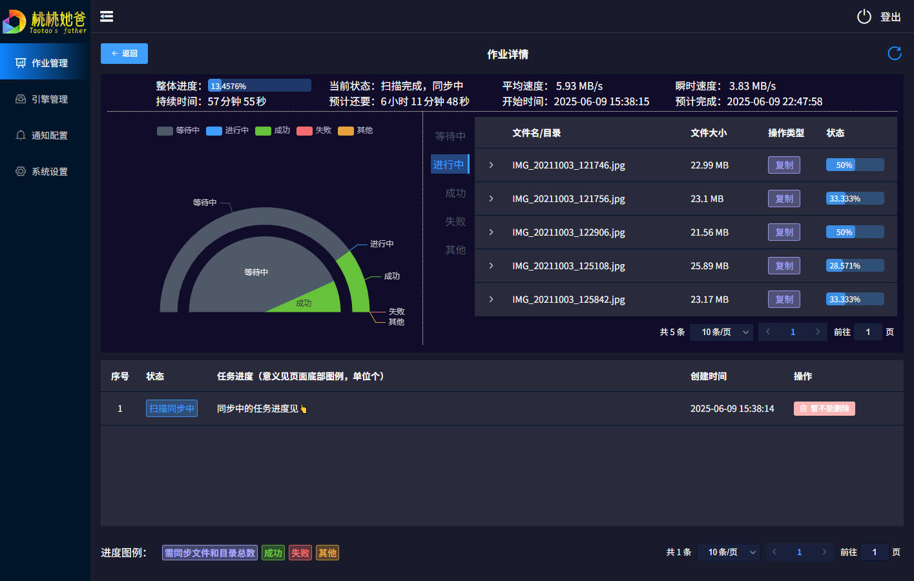
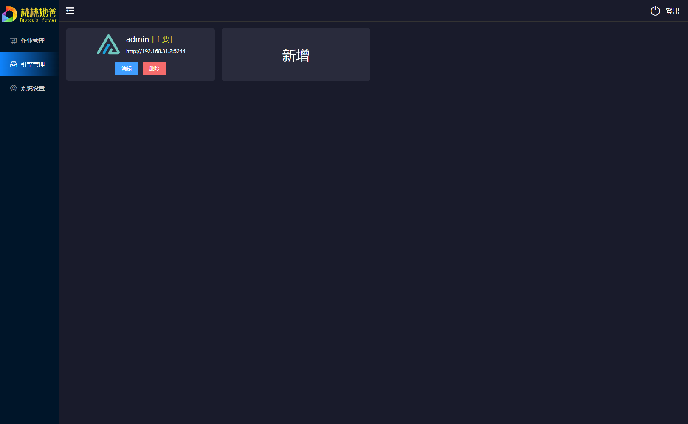
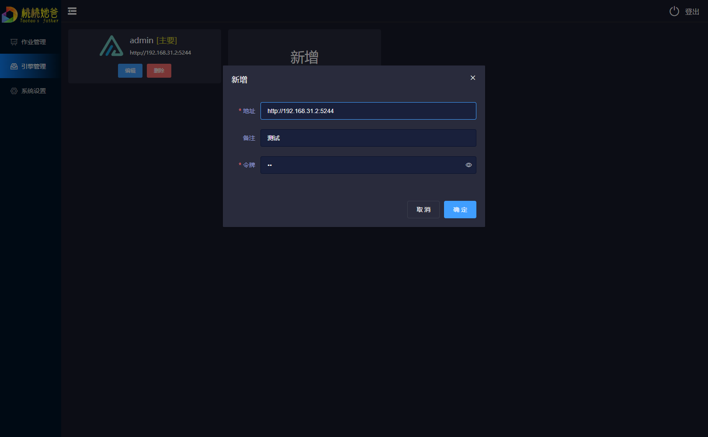
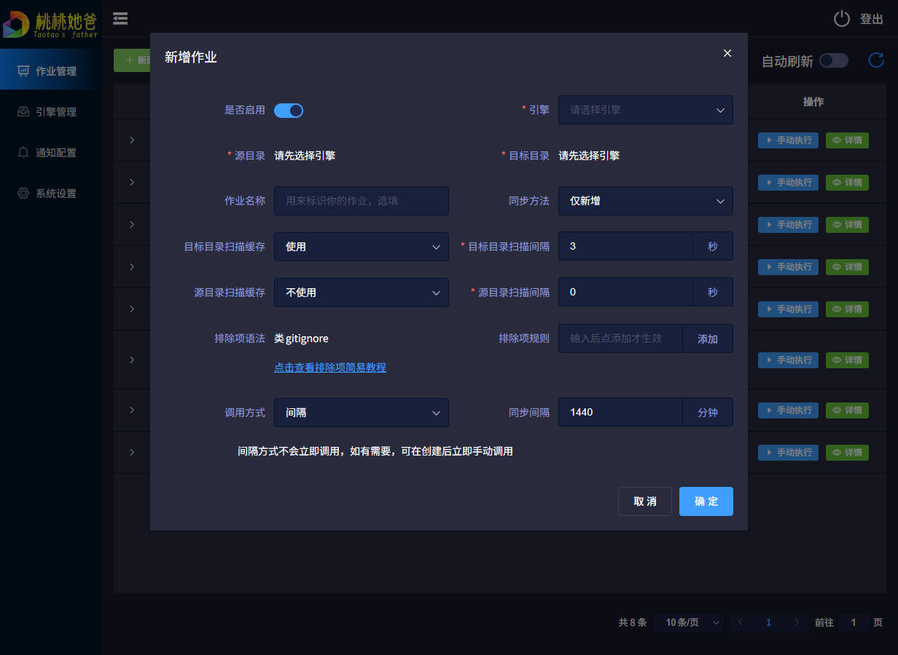
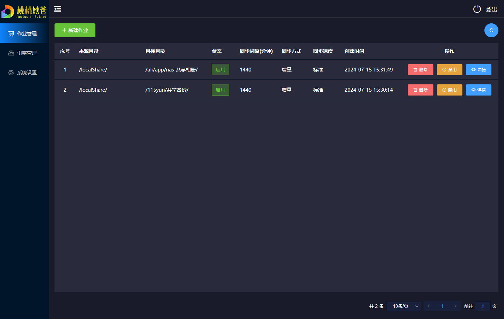
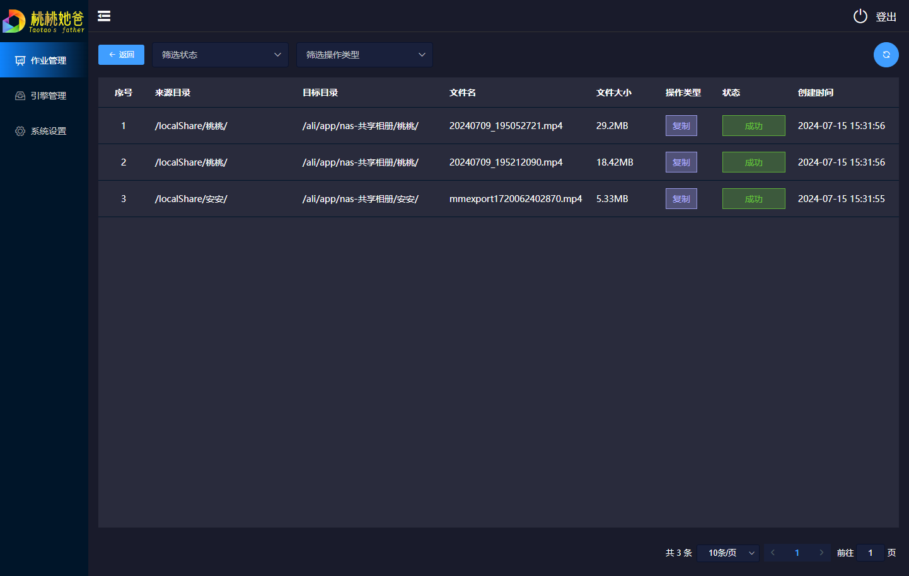
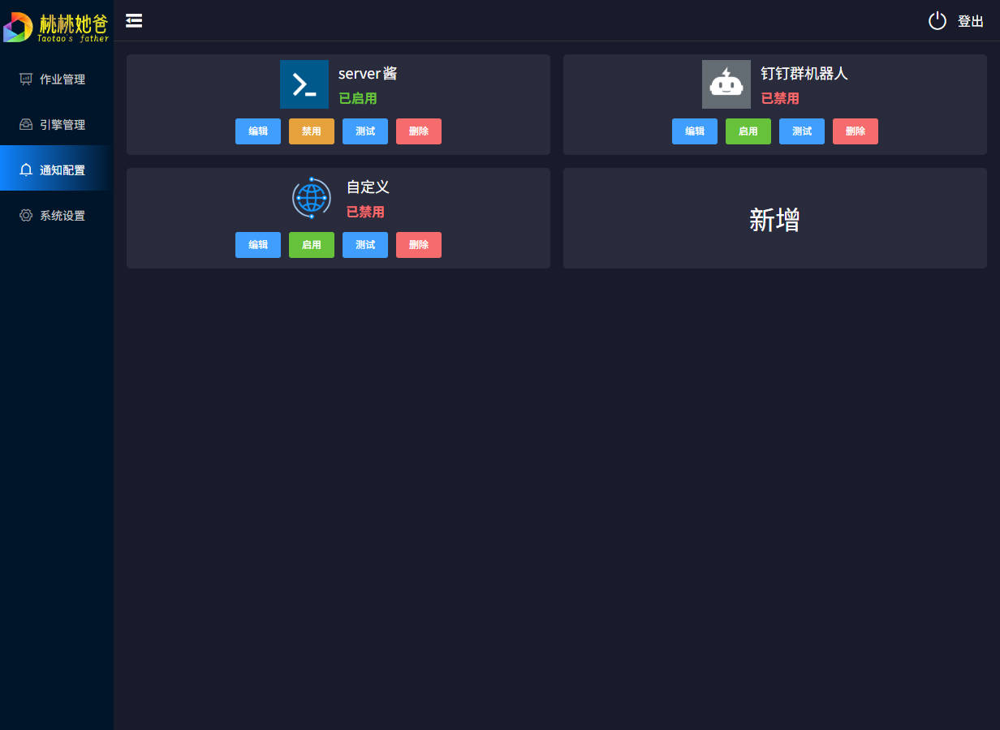

<p align="center">
  <a href="./README.md">English</a> | <strong>简体中文</strong>
</p>

<div align="center">
  <a href="https://github.com/dr34m-cn/taosync">
    
  </a>
  <p><em>TaoSync 是一个带内置存储引擎、并兼容 OpenList/AList v3+ 的自动化同步工具。</em></p>
  <div>
    <a href="https://github.com/dr34m-cn/taosync/blob/main/LICENSE">
      
    </a>
    <a href="https://github.com/dr34m-cn/taosync/actions/workflows/build.yml">
      
    </a>
    <a href="https://www.python.org/">
      
    </a>
    <a href="https://vuejs.org/">
      
    </a>
    <a href="https://github.com/dr34m-cn/taosync/releases">
      
    </a>
    <a href="https://github.com/dr34m-cn/taosync/releases">
      
    </a>
    <a href="https://hub.docker.com/r/dr34m/tao-sync">
      
    </a>
  </div>
</div>

---

桃桃是我女儿的乳名。

本程序开发之初，主要是为了保存桃桃成长的照片，故名`taoSync`

**如果好用，请Star！非常感谢！**  [GitHub](https://github.com/dr34m-cn/taosync) [Gitee](https://gitee.com/dr34m/taosync) [DockerHub](https://hub.docker.com/r/dr34m/tao-sync)

<details>

<summary>点击展开截图</summary>

由于更新频繁，截图仅供参考，以实际为准

#### 作业详情



#### 引擎管理



#### 引擎编辑



#### 新建作业



#### 作业列表



#### 任务详情



#### 通知配置



</details>

## 须知

> [!IMPORTANT]
> TaoSync 默认提供不可删除的内置 `TaoSync` 引擎，无需额外部署 OpenList。需要使用更多 OpenList/AList 驱动时，仍可把外部实例添加为引擎。

> [!WARNING]
> **警告！不要在外网暴露本系统，否则后果自负！**
>
> 本系统已经做了一定的安全方面的工作，但仍不能保证绝对安全。如确实需要，请务必使用强密码，并使用`SSL`

## 用途举例

#### 1. 同步备份

把本地文件备份到多个网盘或FTP之类的存储，或者在多个网盘之间同步文件等；

可以定时扫描指定目录下文件差异，让目标目录与源目录相同（全同步模式）；或仅新增存在于源目录，却不存在于目标目录的文件（仅新增模式）

#### 2. 定时下载

可以设置一次性任务（`cron`方式设置年月日时分秒，将在指定时间执行一次），可在闲时自动从特定网盘下载文件到本地

## 特性

* 开源免费，接受任意审查，几乎支持所有常用平台
  * windows-amd64
  * windows-arm64
  * darwin-amd64
  * darwin-arm64
  * linux-amd64
  * linux-arm64
  * linux-386
  * linux-arm-v6
  * linux-arm-v7
  * linux-s390x
  * linux-ppc64le
  * Android
* [Github Actions](https://docs.github.com/zh/actions)自动打包与发布构建好的可执行程序，过程公开透明，无投毒风险
* 支持Docker，下载即用
* 适配PC&移动端显示，方便易用
* 干净卸载，不用的时候删掉即可，无任何残留或依赖，不影响系统里其他程序
* 数据库内的登录密码以不可逆散列保存，支持重置密码；如通过配置文件或环境变量设置初始密码，请妥善保护相关配置
* 除用户配置的存储服务外完全离线运行，不向 TaoSync 项目方上传用户数据
* 完善的错误处理，稳定可靠，逻辑自洽；可能出错，但永不崩溃（我猜的）
* 完善的日志，所有错误都会被记录
* 内置不可删除的 `TaoSync` 引擎，支持本地目录、SMB、FTP/FTPS、SFTP（SSH）和阿里云盘开放平台
* 兼容外部 `OpenList/AList` 引擎，可继续自由增删改查
* 作业管理，可以新增/删除/启用/禁用/编辑/手动执行作业
* 支持排除项规则，可以排除指定目录或文件不同步
* 支持按文件大小过滤，可分别设置最小和最大值
* 仅新增、全同步、移动三种模式
* 三种同步模式均可启用源目录模式，后续作业只扫描源目录并与数据库快照比较
* 定时同步支持间隔、`cron`、手动调用
* 同步进度、总体进度、同步速度、实时同步文件、预估时间等实时可视化查看
* 存储可控，合理配置任务记录与日志保留天数，可以控制本程序所占用存储在可控范围内
* 支持钉钉群机器人或server酱通知，可在任务成功或失败后发送通知

## 使用方法

### 内置 TaoSync 引擎

首次启动后，引擎管理中会自动出现 `TaoSync`，其初始目录为空。点击目录管理，为每个虚拟目录选择一种存储：

* 本地目录：可直接浏览并选择 TaoSync 进程可访问的现有绝对目录；Docker 中需要先把宿主机目录挂载进容器。
* SMB：填写服务器、共享名、账号以及可选的共享内根目录，使用 SMB 2/3。主机字段可以扫描 TaoSync 活动私网 IPv4 地址所在的 `/24` 网段，列出 TCP 445 可连接设备；也可以继续手动填写。
* FTP：支持 FTP 与显式 TLS（AUTH TLS），填写服务器、账号以及可选的远端根目录。服务端必须支持 `MLSD`，TaoSync 依靠它区分文件、目录和不安全的链接类条目，确保操作不会越出配置的根目录。
* SFTP（SSH）：填写服务器、端口、用户名和远端根目录，可选择密码认证，或直接粘贴 PEM/OpenSSH 私钥并填写可选的私钥口令。`SHA256:` 主机密钥指纹可以留空；建议先测试连接取得实际指纹，再保存该指纹以锁定后续连接使用的服务器公钥。SFTP 写入使用临时文件与原子重命名，服务端覆盖已有文件时需支持 OpenSSH POSIX rename 扩展。
* 阿里云盘：在[阿里云盘开发者门户](https://www.aliyundrive.com/developer)创建应用，通过官方 OAuth 获取 `client_id`、`client_secret` 和 `refresh_token`。TaoSync 调用 `openapi.alipan.com` 的官方 OpenFile API，并自动保存轮换后的 refresh token。

作业中选择 `TaoSync` 后，路径以 `/<虚拟目录名>/...` 显示。复制、建目录、删除、文件大小比较和任务进度都由进程内部完成；不同存储之间的复制会由 TaoSync 中转文件内容。

SFTP v3 无法在所有服务端路径竞态下提供通用的“禁止跟随链接”保证，建议使用服务端 `chroot` 限制 SSH 账号，或确保配置的远端根目录仅该账号可写。存储凭据（包括 SFTP 密码和私钥）目前沿用现有引擎行为，未做静态加密而直接保存在 TaoSync 的 SQLite 数据库中，请妥善保护 `data` 目录。

### 源目录模式

所有成功完成的作业都会把完整源目录清单保存为数据库快照。仅新增、全同步和移动模式都可以开启“源目录模式”：没有可用快照的首次同步仍会扫描源目录与目标目录；之后只扫描源目录，并用当前清单与上一次成功快照的路径、类型、文件大小以及后端可提供的版本指纹差异生成同步操作。

快照只会在源目录完整扫描且本次所有操作成功后原子更新。扫描中断、复制失败或删除失败不会推进快照，下一次作业仍会重试。修改引擎、源/目标路径、同步方式、排除规则或文件大小过滤条件会使旧快照失效，下一次重新扫描目标目录。移动模式会先完成所有目标的复制，再只删除一次源文件。

源目录模式不会读取目标目录，因此无法发现目标端被单独新增、删除或篡改的内容；全同步此时只删除快照中明确管理过的文件并保留目录壳，以免误删排除项或目标端独立文件。需要重新校验目标实际状态时，请暂时关闭源目录模式并成功执行一次作业。后端能提供有效版本元数据时可以识别同路径、同大小的源文件替换，但准确度取决于后端元数据精度；FTP 与 SFTP 服务端可能只提供较弱或粒度较粗的修改时间。移动模式会在删除前绕过缓存复核源文件，并要求稳定的版本指纹；指纹缺失或发生变化时会保留源文件，并把本次操作标记为未完成。所有模式都会拒绝源目录与目标目录相同、互相包含，以及内置挂载别名实际指向同一后端位置的危险配置。

### 先启动

* 可执行程序

前往[Release](https://github.com/dr34m-cn/taosync/releases)下载对应平台的可执行程序，直接执行

* docker

```sh
docker run -d --restart=always -p 8023:8023 -v /opt/data:/app/data --name=taoSync dr34m/tao-sync:latest
```

或docker-compose

```yaml
version: '3.8'

services:
  tao-sync:
    image: dr34m/tao-sync:latest
    container_name: taoSync
    restart: always
    ports:
      - "8023:8023"
    volumes:
      - /opt/data:/app/data
```

把其中`/opt/data`替换为你实际的目录，在部分NAS(如绿联NAS)中，可以使用相对目录，如`./config:/app/data`

#### 与 OpenList 一起部署的 Docker Compose

使用以下 Compose 配置可以同时启动 TaoSync 和 OpenList：

```yaml
services:
  openlist:
    image: openlistteam/openlist:latest
    container_name: openlist
    user: "0:0"
    restart: unless-stopped
    ports:
      - "5244:5244"
    environment:
      UMASK: "022"
      TZ: Asia/Shanghai
    volumes:
      - ./openlist-data:/opt/openlist/data

  tao-sync:
    image: dr34m/tao-sync:latest
    container_name: taoSync
    restart: unless-stopped
    depends_on:
      - openlist
    ports:
      - "8023:8023"
    volumes:
      - ./taosync-data:/app/data
```

启动后，可通过 `http://127.0.0.1:5244` 访问 OpenList，通过 `http://127.0.0.1:8023` 访问 TaoSync。在 TaoSync 中添加引擎时，OpenList 地址应填写 `http://openlist:5244`；Compose 网络内可以直接使用服务名作为主机名。

当前 OpenList 镜像已不再使用 `PUID` 和 `PGID` 环境变量。此示例使用 `user: "0:0"` 以获得较广泛的兼容性；如需按最小权限运行，请将其替换为用于运行 OpenList 的宿主机 UID/GID，并确保该用户对 `./openlist-data` 具有写权限。详情请参阅 [OpenList Docker 文档](https://doc.oplist.org/guide/installation/docker)。

### 再使用

访问`http://127.0.0.1:8023`

默认账号为`admin`。当初始密码配置为`RANDOM`时，密码请到日志中查看；如果手动配置了密码，请直接使用该值登录。登录后请立即前往系统设置修改密码

> [!NOTE]
> 如果没有显示这个日志，可以到同级目录的`data/log/sys_xxx.log`文件查看，通常在第一行

进入系统后先到`引擎管理`为内置 TaoSync 引擎添加目录，或添加外部 OpenList/AList 引擎，然后前往`作业管理`创建同步作业

## 配置项

<details>
<summary>点击展开配置项</summary>

配置优先级：`data/config.ini`>`环境变量`>`默认值`；前一个存在，则后边都将被**忽略**。修改配置需重启程序或Docker。

`data/config.ini`文件示例（如该文件存在，则**优先级最高**）

```ini
[tao]
# 初始管理员密码，仅首次创建数据库时生效；RANDOM或空值表示随机生成
password=RANDOM
# 运行端口号
port=8023
# 登录有效期，单位天
expires=2
# 日志等级：0-DEBUG，1-INFO，2-WARNING，3-ERROR，4-CRITICAL；数值越大，产生的日志越少，推荐1或2
log_level=1
# 控制台日志等级：适用于v0.2.3及之后版本，与上同
console_level=2
# 系统日志保留天数，该天数之前的日志会自动清理，单位天，0表示不自动清理
log_save=7
# 任务记录保留天数，该天数之前的记录会自动清理，单位天，0表示不自动清理
task_save=0
# 任务执行超时时间，单位小时。一定要设置长一点，以免要备份的东西太多
task_timeout=72
```

上边的文件默认不存在，如需要，您可以手动在程序同级目录的`data`目录下创建`config.ini`，并填入上边的内容。注意，文件应使用`UTF-8`编码

| config.ini    | Docker环境变量    | 描述                                                         | 默认值           |
| ------------- | ----------------- | ------------------------------------------------------------ |---------------|
| password      | TAO_PASSWORD      | 初始管理员密码，仅首次创建数据库时生效；`RANDOM`或空值表示随机生成；兼容旧变量`TAO_PASSWD` | RANDOM        |
| port          | TAO_PORT          | 运行端口号                                                   | 8023          |
| expires       | TAO_EXPIRES       | 登录有效期，单位天                                           | 2             |
| log_level     | TAO_LOG_LEVEL     | 日志等级：0-DEBUG，1-INFO，2-WARNING，3-ERROR，4-CRITICAL；数值越大，产生的日志越少，推荐1或2 | 1             |
| console_level | TAO_CONSOLE_LEVEL | 控制台日志等级：适用于v0.2.3及之后版本；与上同               | 2             |
| log_save      | TAO_LOG_SAVE      | 系统日志保留天数，该天数之前的日志会自动清理，单位天，0表示不自动清理 | 7             |
| task_save     | TAO_TASK_SAVE     | 任务记录保留天数，该天数之前的记录会自动清理，单位天，0表示不自动清理 | 0             |
| task_timeout  | TAO_TASK_TIMEOUT  | 任务执行超时时间，单位小时。一定要设置长一点，以免要备份的东西太多 | 72            |
| -             | TZ                | 时区                                                         | Asia/Shanghai |

</details>

## 研发状态

历史记录在[这里](https://github.com/dr34m-cn/taosync/tree/main/doc/changelog)；

如想体验研发中的版本(可能存在明显错误或严重bug，不建议小白尝试)，可以尝试到[DockerHub](https://hub.docker.com/r/dr34m/tao-sync)或[Release](https://github.com/dr34m-cn/taosync/releases)找最新的含`dev`或`pre`的tag，例如`v0.1.0-dev-build0`

### 规划中（随时改变or因太难不做了，概不负责）

* windows版本优化（开机自启，隐藏页面，启动停止等）[#13](https://github.com/dr34m-cn/taosync/issues/13)
* OpenList支持加密同步 [#18](https://github.com/dr34m-cn/taosync/issues/18)
* 本地引擎支持加密同步
* 保留历史N个版本（N可自定义，可无限）
* 配置导入导出
* linux一键安装、更新与卸载脚本
